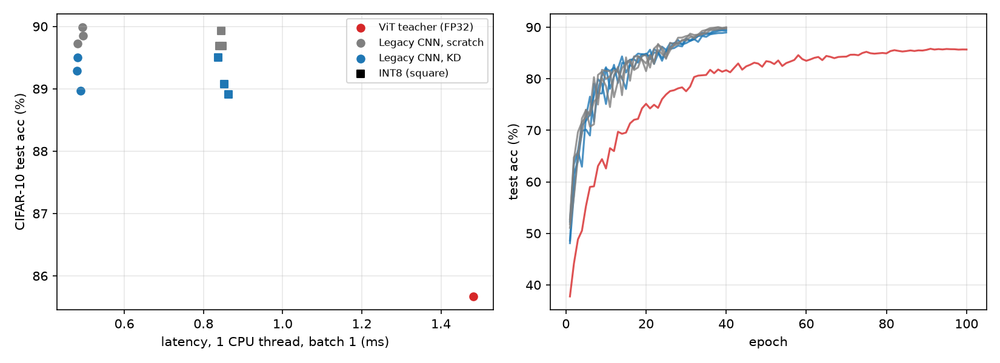

# kd-legacy-hw

Can knowledge distillation move a model built on *modern* operators onto *legacy* AI hardware that
does not support them? This is a small, fully reproducible CIFAR-10 study of that question.

- **Teacher (the "new" model):** a small ViT (3.2M params). It depends on GELU, LayerNorm and softmax attention,
  which older INT8 edge accelerators and DSPs often cannot run natively.
- **Student (the "legacy-compatible" model):** a VGG-style CNN (0.29M params) restricted to
  Conv / BatchNorm / ReLU / MaxPool / Linear, fused and post-training quantized to INT8.
- **Compared:** the student trained from scratch vs. the student trained with logit KD from the teacher
  (T = 4, α = 0.9). Each variant is run with 3 seeds.
- **Legacy-HW profile:** the op-set check (`models.LEGACY_OPS`), INT8 PTQ (qnnpack), and
  batch-1 latency on **one CPU thread**, used as a stand-in for a weak edge device.

## Results (Apple M4 Max; training on MPS, latency on 1 CPU thread)

| Model | Test acc | Agreement with teacher | Params | Size | Latency (bs=1) | Unsupported ops |
|---|---|---|---|---|---|---|
| Teacher ViT, FP32 | 85.67% | 100% | 3.19M | 12.8 MB | 1.48 ms | GELU, LayerNorm, Attention |
| Student, scratch, FP32 | 89.86 ± 0.13% | 83.63 ± 0.16% | 0.29M | 1.17 MB | 0.49 ms | none |
| Student, scratch, INT8 | 89.77 ± 0.14% | 83.53 ± 0.14% | 0.29M | 0.30 MB | 0.84 ms | none |
| Student, KD, FP32 | 89.25 ± 0.27% | 83.70 ± 0.31% | 0.29M | 1.17 MB | 0.48 ms | none |
| Student, KD, INT8 | 89.16 ± 0.30% | 83.62 ± 0.35% | 0.29M | 0.30 MB | 0.85 ms | none |

Mean ± std over 3 seeds. Per-run numbers are in `results/bench.json`, and training curves in `results/*.json`.



Full experimental design report: [`report/report.pdf`](report/report.pdf).

## What I found (including the negative results)

1. **The op-set gap is real and cheap to close architecturally.** The Conv-only student runs every op
   on the legacy list. It is 11× smaller and 3× faster than the ViT on one CPU thread, and INT8 PTQ costs it
   only about 0.1 pt of accuracy.
2. **Vanilla logit KD did *not* help here.** The KD student is 0.6 pt *less* accurate than scratch training.
   Its agreement with the teacher is unchanged (83.7% vs 83.6%, within seed noise). A ViT trained from scratch
   on CIFAR-10 (85.7%) is a weaker classifier than the small CNN, so matching its soft labels does not pull
   the student toward the teacher's *behaviour*. It mostly adds noise. For backward compatibility, the goal is
   to reproduce the new model on old hardware, and the ~16% disagreement is exactly the gap to close.
   Logit KD across an attention→conv architecture gap is not enough to close it. Splitting agreement by
   teacher correctness (`analyze.py`) shows that KD raises agreement on the teacher's *mistakes* from 20.45% to 22.56%
   and slightly lowers it where the teacher is right. In other words, KD copies the teacher's errors.
3. **INT8 was *slower* than FP32 on this machine** (0.85 ms vs 0.49 ms). Apple Silicon's FP32 CPU path is
   highly optimized, and qnnpack is not tuned for it. Whether INT8 is faster depends on the hardware, which
   is the whole motivation for hardware-aware distillation. The measurement is not a claim about real
   legacy accelerators.

## Next steps I would try

- Feature/attention-map distillation and teachers trained with stronger recipes. Directly optimize
  agreement (e.g. a KL term on the teacher's argmax plus a disagreement-weighted loss).
- Search for the student's op-set and quantization jointly under a real target's latency model,
  rather than a fixed CNN.
- Profile on actual older hardware (e.g. a Raspberry Pi / an older mobile NPU) instead of 1-thread CPU.

## Reproduce

```bash
python -m venv .venv && .venv/bin/pip install torch torchvision numpy matplotlib
PY=.venv/bin/python ./run_all.sh      # ~70 min on M4 Max (teacher 100 ep, 6 student runs × 40 ep)
```

`models.py` defines the teacher/student and the legacy op-set check, `train.py` handles teacher / scratch / KD
training, `bench.py` runs INT8 PTQ, accuracy, agreement and latency, and `plot.py` draws the figure.

Related: hand-written implementations of the "modern" operators (GELU, LayerNorm, GQA attention) are in my
[DL_Operator_reproduction](https://github.com/austinchennn/DL_Operator_reproduction) repo.
